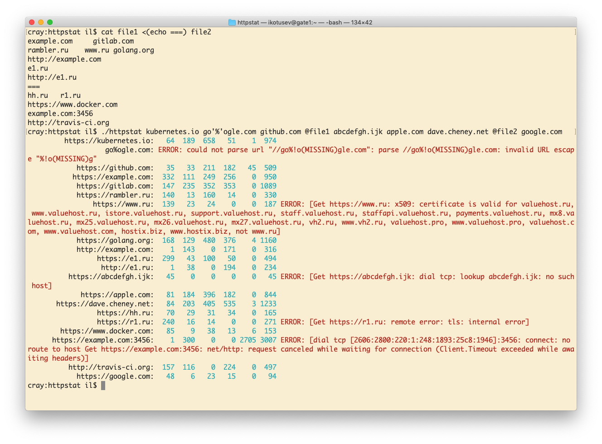
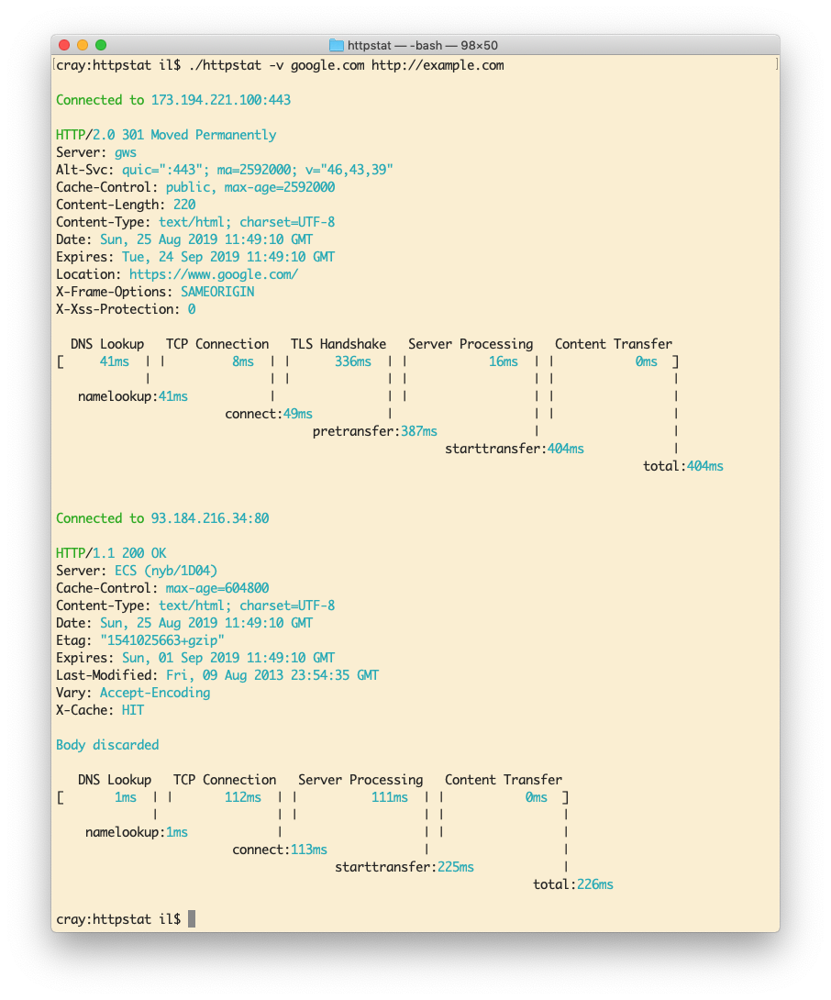

# httpstat [](https://travis-ci.org/soxipy/httpstat) [](https://goreportcard.com/report/github.com/soxipy/httpstat)

Many thanks to Dave Cheney and to all who contribute!

## Why yet another httpstat

- It is a diagnostics tool with full error stacking not just a profiler. The original httpstat exit with the last aimless error message (ex. Client.Timeout exceeded) without profiling in case of something goes wrong.
- It eats as many URL as you give it mixing single args with one from @files in any combination: that's why a silent form is a default now.
- More precise timings
- More reasonable timeouts
- and more to come, see TODO




## Installation

`httpstat` requires Go 1.11 or later.

```sh
go get github.com/soxipy/httpstat
```

## Usage

```sh
httpstat example.com another.url @file1 url1.com url2.com @file2 ...
```

## Features

- MacOS/Windows/BSD/Linux supported.
- HTTP and HTTPS are supported, for self signed certificates use `-k`.
- Skip timing the body of a response with `-I`.
- Follow 30x redirects with `-L`.
- Change HTTP method with `-X METHOD`.
- Provide a `PUT` or `POST` request body with `-d string`. To supply the `PUT` or `POST` body as a file, use `-d @filename`.
- Add extra request headers with `-H 'Name: value'`.
- The response body is usually discarded, you can use `-o filename` to save it to a file, or `-O` to save it to the file name suggested by the server.
- HTTP/HTTPS proxies supported via the usual `HTTP_PROXY`/`HTTPS_PROXY` env vars (as well as lower case variants).
- Supply your own client side certificate with `-E cert.pem`.
- Pass any number of URLs including from @file. URLs in file is a set of words delimited with whitespace characters, tabs and new lines.

## TODO

- Make requests in parallel: each URL in its own goroutine
- Custom CA certs
